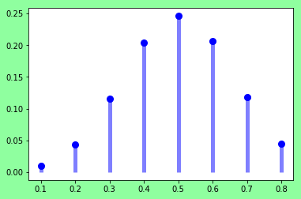
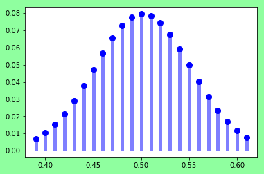
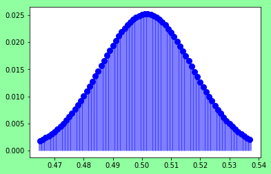
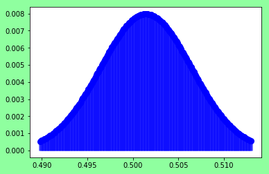
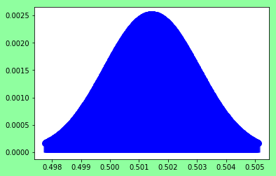

Here, looking at the recent recount in Georgia as an example around determining, what would a good number of votes to randomly sample to help validate an election result.

According to the latest results of this writing there is 

```
B, T = 2472182, 2458010
p_observed = B*1./(B + T) # 0.501437
```
For now just starting off below visualizing the binomial distribution around the `p_observed` for different numbers of samples to look at what likelihoods are assigned to the different outcomes specified by that given binomial distribution.


```python
from scipy.stats import binom
import numpy as np
import matplotlib.pyplot as plt
import pylab
```


```python
B, T = 2472182, 2458010
p_observed = B*1./(B + T)


def do_plot(n, p):
    fig, ax = plt.subplots(1, 1)
    fig.patch.set_facecolor('xkcd:mint green')

    mean, var, skew, kurt = binom.stats(n, p, moments='mvsk')
#    print('mean, ', mean, 'var', var)
    print('mean, ', mean/n, 
          #'var', var/n
         )
    x = np.arange(binom.ppf(0.01, n, p),

                  binom.ppf(0.99, n, p))
    y = binom.pmf(x, n, p)
    print('sum y,', y.sum())
    # with plt.style.context('fivethirtyeight'):
    x2 = x/n
    ax.plot(x2, y, 'bo', ms=8, label='binom pmf')
    ax.vlines(x2, 0, y, colors='b', lw=5, alpha=0.5)
    plt.show()
    return list(zip(x2, y))
```


```python
p=p_observed
print(f'n={n}, p={p}')
a = do_plot(n=10, p=p)
sum(x[1] for x in a if x[0] < 0.5)
```

    n=10, p=0.5014372665405323
    mean,  0.5014372665405323
    sum y, 0.9880537609732434





    0.37247237316599874


```python
p=p_observed
print(f'n={n}, p={p}')
a = do_plot(n=100, p=p)
sum(x[1] for x in a if x[0] < 0.5)
```

    n=10, p=0.5014372665405323
    mean,  0.5014372665405323
    sum y, 0.9789685520962167





    0.4390661773494172


```python
p=p_observed
print(f'n={n}, p={p}')
a = do_plot(n=1000, p=p)
sum(x[1] for x in a if x[0] < 0.5)
```

    n=10, p=0.5014372665405323
    mean,  0.5014372665405323
    sum y, 0.9790245952379818





    0.44151098858308324


```python
p=p_observed
print(f'n={n}, p={p}')
do_plot(n=10000, p=p)
```

    n=10, p=0.5014372665405323
    mean,  0.5014372665405323
    sum y, 0.9801955037573005





```python
p=p_observed
print(f'n={n}, p={p}')
do_plot(n=100000, p=p)
```

    n=10, p=0.5014372665405323
    mean,  0.5014372665405323
    sum y, 0.9800587882139997





Seeing above, that 


```python

```


```python

```


```python

```


```python

```


```python

```
